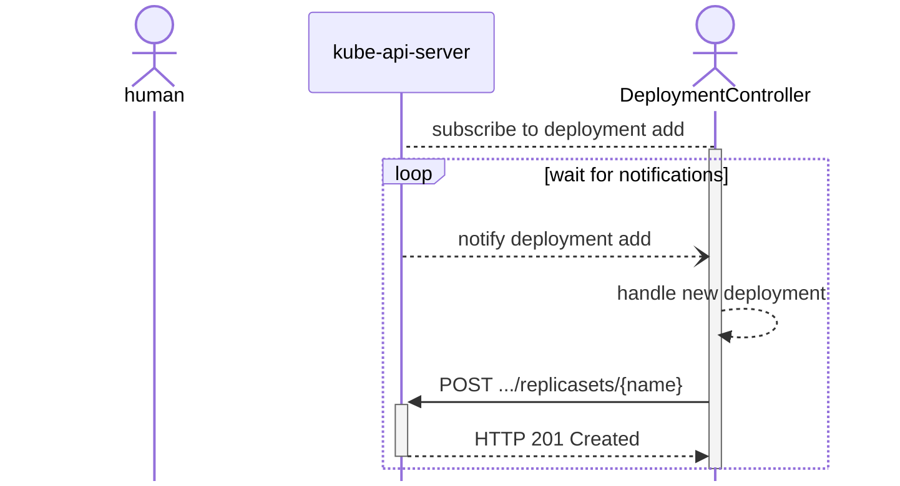
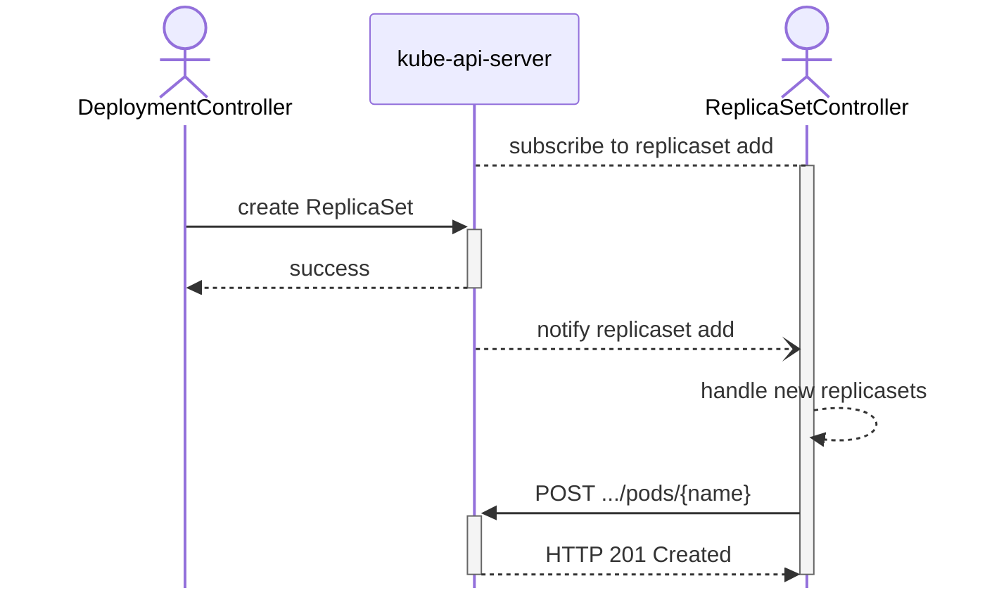
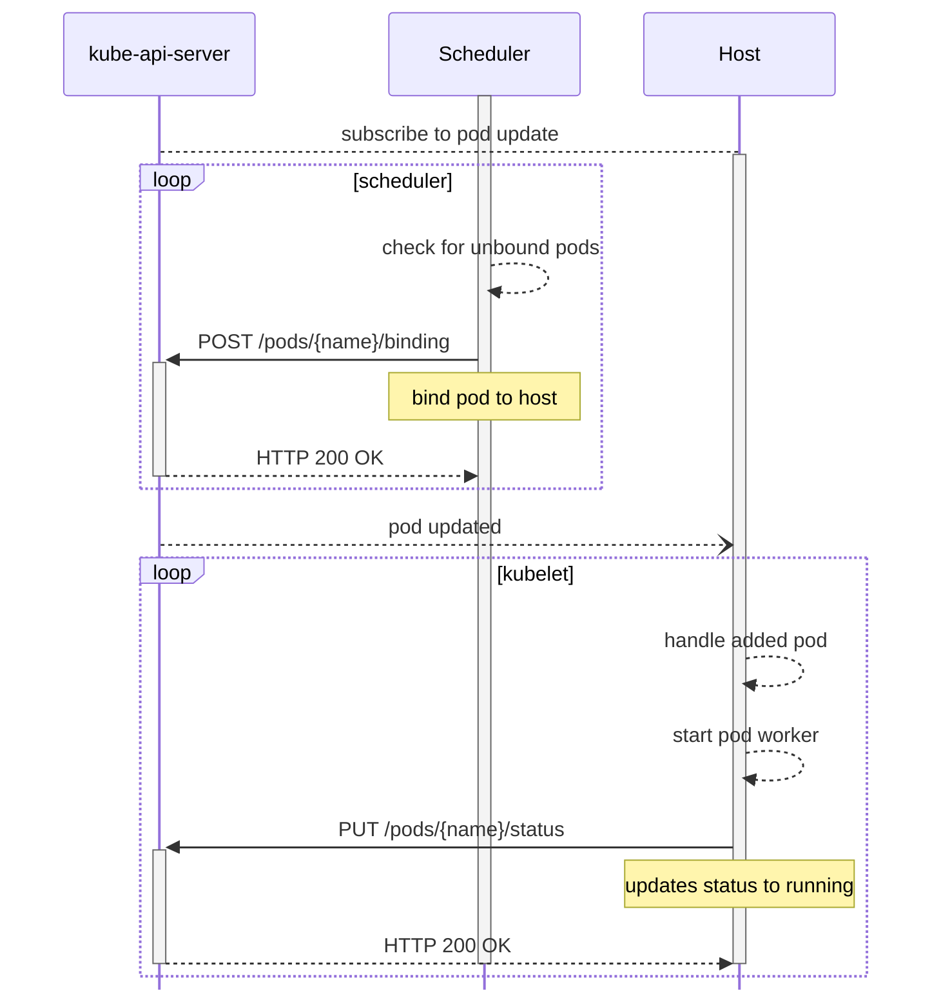

Kubernetes tutorials told me ***what** to do*,
but always left me wondering:

- *why am I doing this?*
- *what is happening?*

I dug deeper, looked under the covers, and what I found has helped me better
understand, describe and apply what I've learned.

The jargon and magic may seem intimidating, but read on and we'll break down the
kubernetes API into simple, familiar building blocks.

<!-- 
When I first read kubernetes tutorials, I was frustrated by the amount
of "magic" used in the explanations. In my day to day life using kubernetes, I
take advantage of that magic, but my knowledge of what's happening under the hood
has been valuable in understanding and interacting with the kubernetes API.  -->


## Hello Kubernetes

> `kubernetes` at its **very** simplest is a standard set of extensible APIs to start,
track, and stop the execution of containers running on a set of computers.

All of your basic interactions with kubernetes do nothing more than send JSON
with HTTP requests. 

### kubectl apply

`kubectl apply` provides a "declarative" method for managing kubernetes `resources`. 
Behind the scenes, it's really just a convenience wrapper for simple HTTP Apis.

> a `resource` is an http endpoint in the Kubernetes API that represents a
> collection of API "objects" of a certain type.

Let's look at what happens when you call `kubectl apply` on this `Deployment`
from the [Hello Minikube] tutorial.

```yaml
# deployment.yaml
---
kind: Deployment
apiVersion: apps/v1
metadata:
  name: hello-node
  labels:
    app: hello-node
spec:
  replicas: 1
  selector:
    matchLabels:
      app: hello-node
  template:
    metadata:
      labels:
        app: hello-node
    spec:
      containers:
      - name: hello-node
        image: k8s.gcr.io/echoserver:1.4
```

We'll be adding `--v=8` to let us see what requests it sends. This will enable
tracing/debug logging.

```shell
$ kubectl --v=8 apply -f deployment.yaml
...
HTTP GET /apis/apps/v1/namespaces/default/deployments/hello-node
Response HTTP 404 Not Found in 3 millisecondss
...
HTTP POST /apis/apps/v1/namespaces/default/deployments?fieldManager=kubectl-client-side-apply
Request Body: {"apiVersion": "apps/v1", "kind": "Deployment","metadata": {...}, "labels": { "app": "hello-node" }, "name": "hello-node", "namespace": "default" }, "spec": { "replicas": 1, "selector": { "matchLabels": { "app": "hello-node" }}, "template": { "metadata": { "labels": { "app": "hello-node" }}, "spec": { "containers": [ { "image": "k8s.gcr.io/echoserver:1.4", "name": "hello-node" }]}}}}
```

### Let's review

Put more simply, with the help of `kubectl apply` we just:
1. checked for an existing `Deployment`
2. called `POST .../deployments` to create a new `Deployment`
3. `???`

### Wait, what is a deployment?

In kubernetes usage, a `Deployment` is a resource that describes at least:

- an identifier (`name`)
- instructions for how to start a single container (`template`)
- a number of containers to start (`replicas`)
- rules to follow when updating the deployment.
  - for example, `StrategyType: RollingUpdate` [(docs)][RollingUpdate]

For an example, let's look at the results of our  command above:
```shell
$ kubectl get deployment hello-node -o wide
NAME         READY   UP-TO-DATE   AVAILABLE   AGE   CONTAINERS   IMAGES                      SELECTOR
hello-node   1/1     1            1           10m   hello-node   k8s.gcr.io/echoserver:1.4   app=hello-node
```

Looking at our deployment, we can see that it is named `hello-world` and has 1 running container, corresponding to the 1 `replica` requested when we created it.

## Breaking down deployments

A lot has just happened in the background. We've used the api create a deployment,
lets explore how `controllers` took that request and started the containers
we wanted.

> `controllers` are autonomous computer programs that leverage the kubernetes
> APIs to add custom behaviors to it. They might:
> - Add addional APIs
> - Handle new custom types
> - Send ☹️ in slack when things break
> 
> The posssibilities are truly endless 


### DeploymentController [(code)][DeploymentController Code]

The `DeploymentController` is the software that provides/configures the
deployment resource.

> **If you want to learn more about how kubernetes does what I describe, just
> click the [(code)](#) links to be taken to the code that performs it!*

The `DeploymentController` is the first stop our request takes on its way
to becoming a container. 





When the `DeploymentController` sees a new deployment, it creates a new
`ReplicaSet` using the information from the template.
[(code)][DeploymentController Create RS Code]


### ReplicaSetController [(code)][ReplicaSetController Code]

The `ReplicaSetController` is the software responsible for providing and configuring
the replicaset resource. [(code)][ReplicaSetController Code] [(startup code)][kube-controller-manager start ReplicaSetController]

Once a new `ReplicaSet` is added, the `ReplicaSetController` is notified and
creates a new `Pod` to run the containers



### Scheduler [(code)][Scheduler Code]

The `Scheduler` has traditionally been a special controller in the kubernetes
ecosystem, but now can be configured and replaced just like other controllers.
It does not create any new resources. It is responsible for binding pods to
individual servers, and It interacts with the kubernetes API in largely the same
way as the other controllers.

Once a new `Pod` is created, the `Scheduler` is notified [(code)][Scheduler Pod Add Code]
and binds it to a `Node` during the next scheduler loop.
[(loop code)][Scheduler Pod Bind Code]
[(bind code)][Scheduler Default Binder Code]




Finally, the `kubelet` listens for updates to Pods that match its node name
[(code)][kubelet watch pods Code], starts the containers, and then updates
the pods status to running [(code)][kubelet Handle Pods Code] 

> the `kubelet` is the software that runs on each server (also called a `Node`)
> that starts, stops and monitors containers.

## Putting it all together

`kubectl create deployment` is just one way to run software in kubernetes.
The extenisble api allows any number of off-the-shelf or custom controllers to help you
rapidly build and \terate on complex software. The power of kubernetes 
emerges from the interactions of these simple parts.

Web Sites/Databases/Game Servers/Resta APIs and more can all be managed by
kubernetes as long as there is controller software to help orchestrate them.

## But Dan...

> What good is my Web Site/Database/Game Server..., if noone can access it!? 

Stay tuned for a follow up post, we'll break down kubernetes networking, 
explore cluster DNS and discuss how it can help make your software configuration
more repeatable.


[DeploymentController Code]: https://github.com/kubernetes/kubernetes/blob/master/pkg/controller/deployment/deployment_controller.go
[ReplicaSetController Code]: https://github.com/kubernetes/kubernetes/blob/master/pkg/controller/replicaset/replica_set.go#L82
[Scheduler Code]: https://github.com/kubernetes/kubernetes/blob/master/pkg/scheduler/scheduler.go#L86

[DeploymentController create RS Code]: https://github.com/kubernetes/kubernetes/blob/master/pkg/controller/deployment/sync.go#L223

[hello minikube]: https://kubernetes.io/docs/tutorials/hello-minikube/

[RollingUpdate]: https://kubernetes.io/docs/concepts/workloads/controllers/deployment/#rolling-update-deployment

[Scheduler]: https://github.com/kubernetes/kubernetes/blob/master/cmd/kube-scheduler/app/server.go#L71

[Scheduler Informers Code]: https://github.com/kubernetes/kubernetes/blob/master/pkg/scheduler/eventhandlers.go#L249
[Scheduler Pod Add Code]: https://github.com/kubernetes/kubernetes/blob/master/pkg/scheduler/eventhandlers.go#L186
[Scheduler Pod Bind Code]: https://github.com/kubernetes/kubernetes/blob/master/pkg/scheduler/scheduler.go#L709
[Scheduler Default Binder Code]: https://github.com/kubernetes/kubernetes/blob/56062f7f4fc56e038f9ab99042457183896c47bb/pkg/scheduler/framework/plugins/defaultbinder/default_binder.go#L57

[kubelet watch pods Code]: https://github.com/kubernetes/kubernetes/blob/master/pkg/kubelet/config/apiserver.go#L38
[kubelet Handle Pods Code]: https://github.com/kubernetes/kubernetes/blob/f97825e1cea6d06813c53319c70e2568778067f0/pkg/kubelet/kubelet.go#L2202

[kube-controller-manager]: https://kubernetes.io/docs/concepts/overview/components/#kube-controller-manager
[kube-controller-manager Code]: https://github.com/kubernetes/kubernetes/blob/master/cmd/kube-controller-manager/app/controllermanager.go#L415
[kube-controller-manager start DeploymentController]: https://github.com/kubernetes/kubernetes/blob/master/cmd/kube-controller-manager/app/apps.go#L73
[kube-controller-manager start ReplicaSetController]: https://github.com/kubernetes/kubernetes/blob/master/cmd/kube-controller-manager/app/apps.go#L63
[kube-scheduler Run Code]: https://github.com/kubernetes/kubernetes/blob/master/cmd/kube-scheduler/app/server.go#L229
[kube-scheduler now standalone]: https://github.com/kubernetes/kubernetes/commit/2c1221864df05a1fe1f8cdc362ea8121d2c2330b