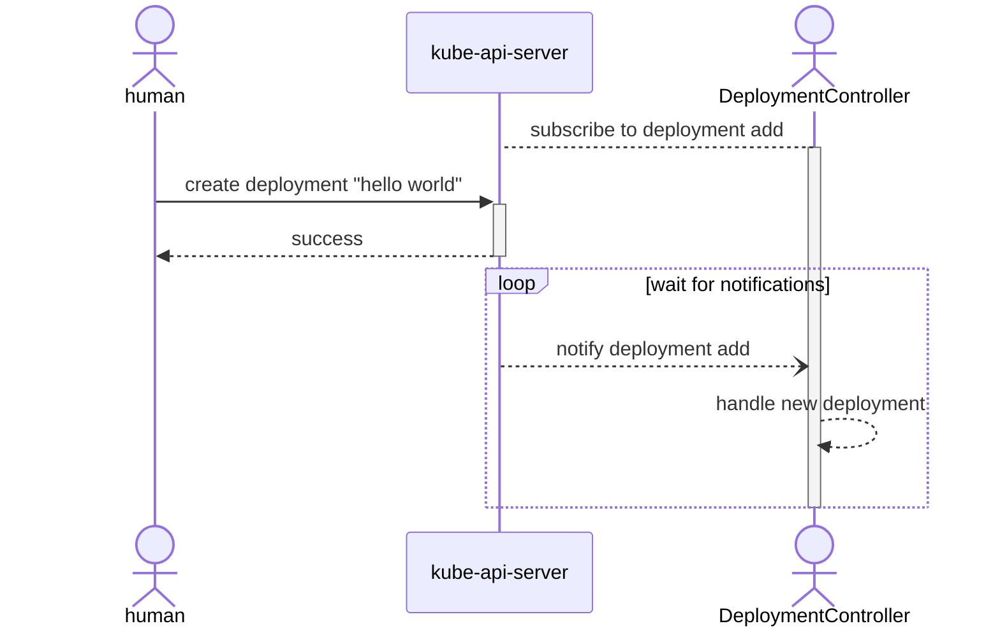
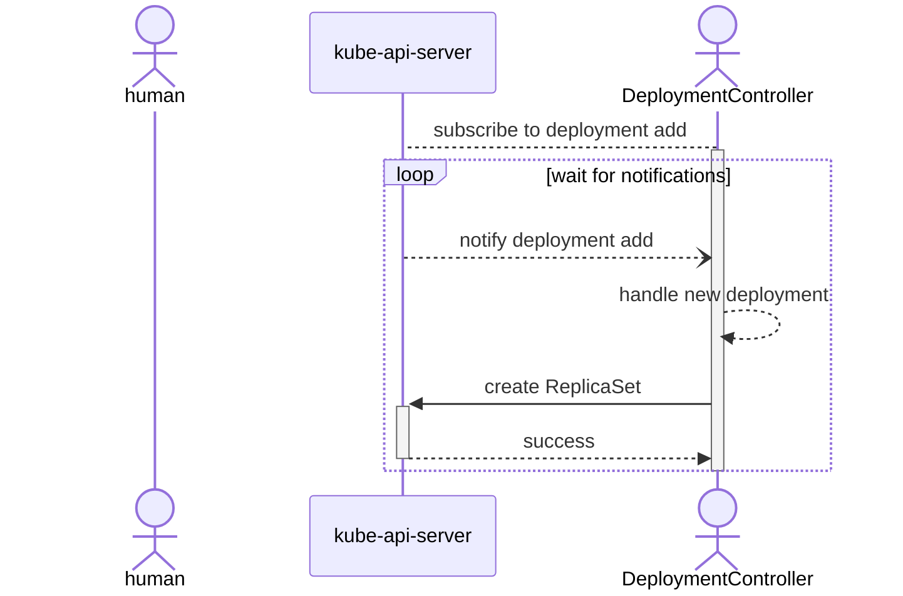
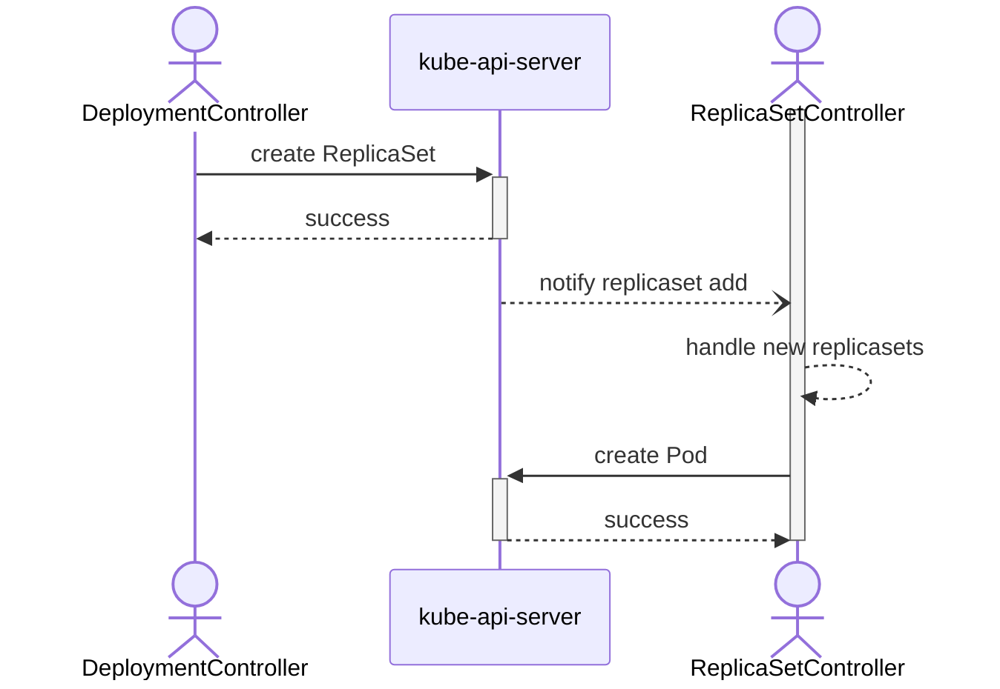
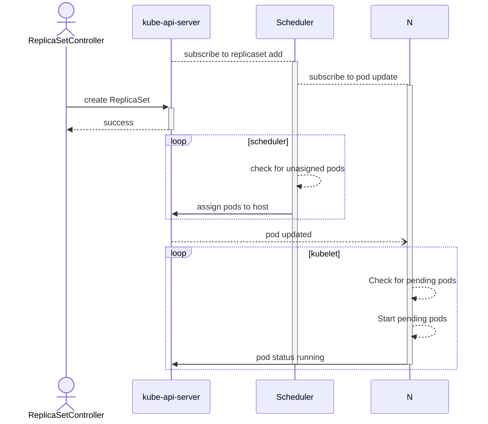
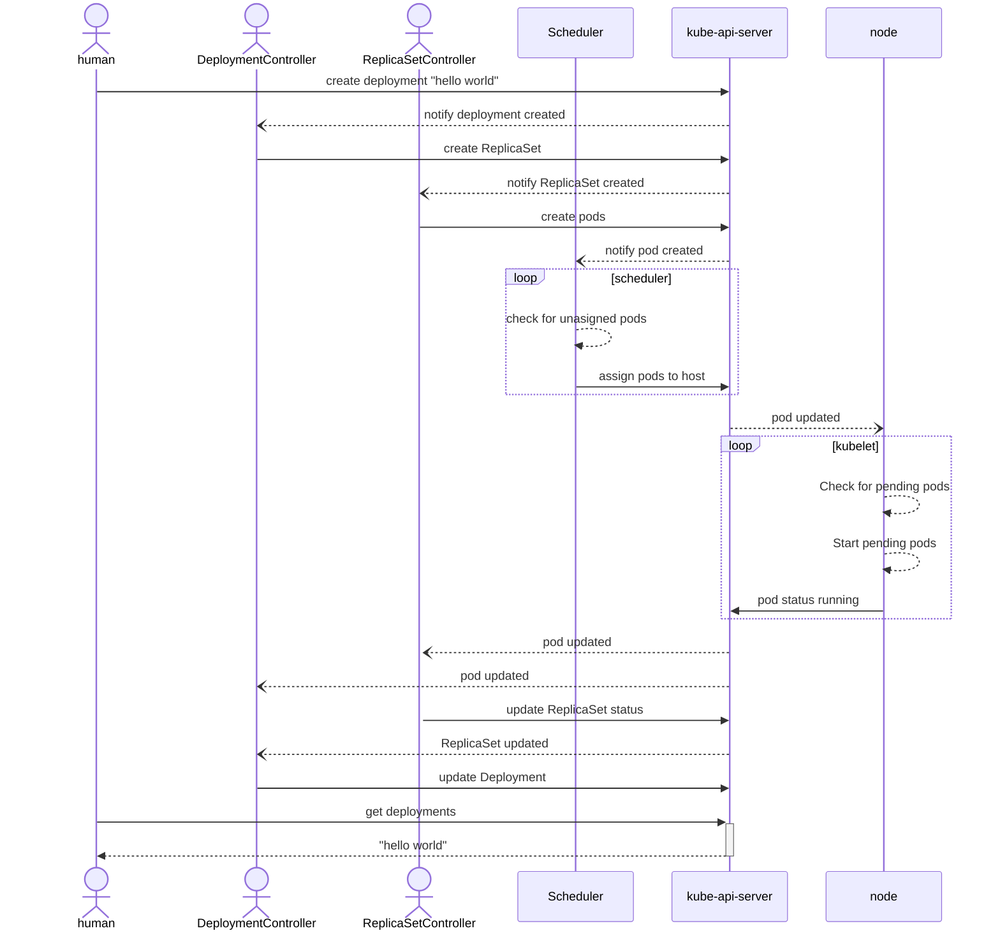

> This Post is still a Work In Progress! and may contain inaccuracies

Kubernetes tutorials told me ***what** to do*,
but always left me wondering:

- *why am I doing this?*
- *what is happening?*

I dug deeper, looked under the covers, and what I found has helped me better
understand, describe and apply what I've learned.

The jargon and magic may seem intimidating, but read on and we'll break down the
kubernetes API into the simple, familiar building blocks.

<!-- 
When I first read kubernetes tutorials, I was frustrated by the amount
of "magic" used in the explanations. In my day to day life using kubernetes, I
take advantage of that magic, but my knowledge of what's happening under the hood
has been valuable in understanding and interacting with the kubernetes API.  -->


## Hello Kubernetes

> `kubernetes` at its **very** simplest is a standard set of extensible APIs to start,
track, and stop the execution of containers running on a set of computers.

All of your basic interactions with kubernetes do nothing more than send JSON
with HTTP requests. 

### kubectl apply

`kubectl apply` provides a "declarative" method for managing kubernetes resources, 
behind the scenes, it's really just a convenience wrapper for things you're the
same HTTP Apis.

> a `resource` is an http endpoint in the Kubernetes API that represents a
collection of API "objects" of a certain type.

Let's look at what happens when you call `kubectl apply` on this `deployment`
from the [Hello Minikube] tutorial.

```yaml
# deployment.yaml
---
kind: Deployment
apiVersion: apps/v1
metadata:
  name: hello-node
  labels:
    app: hello-node
spec:
  replicas: 1
  selector:
    matchLabels:
      app: hello-node
  template:
    metadata:
      labels:
        app: hello-node
    spec:
      containers:
      - name: hello-node
        image: k8s.gcr.io/echoserver:1.4
```
We'll be adding `--v=8` to let us see what requests it sends. This will enable
tracing/debug logging.

```shell
$ kubectl --v=8 apply -f deployment.yaml
...
HTTP GET /apis/apps/v1/namespaces/default/deployments/hello-node
Response HTTP 404 Not Found in 3 millisecondss
...
HTTP POST /apis/apps/v1/namespaces/default/deployments?fieldManager=kubectl-client-side-apply
Request Body: {"apiVersion": "apps/v1", "kind": "Deployment","metadata": {...}, "labels": { "app": "hello-node" }, "name": "hello-node", "namespace": "default" }, "spec": { "replicas": 1, "selector": { "matchLabels": { "app": "hello-node" }}, "template": { "metadata": { "labels": { "app": "hello-node" }}, "spec": { "containers": [ { "image": "k8s.gcr.io/echoserver:1.4", "name": "hello-node" }]}}}}
```

Put more simply, with the help of `kubectl apply` we just:
1. checked for an existing `deployment`
2. called `POST .../deployments` to create a new `deployment`

### What is a deployment?

In kubernetes usage, a `Deployment` is a resource that describes at least:

- an identifier (`name`)
- instructions for how to start a single container (`template`)
- a number of containers to start (`replicas`)
- rules to follow when updating the deployment.
  - for example, `StrategyType: RollingUpdate` [(docs)][RollingUpdate]

For an example, let's look at the results of our  command above:
```shell
$ kubectl get deployment hello-node -o wide
NAME         READY   UP-TO-DATE   AVAILABLE   AGE   CONTAINERS   IMAGES                      SELECTOR
hello-node   1/1     1            1           10m   hello-node   k8s.gcr.io/echoserver:1.4   app=hello-node
```

Looking at our deployment, we can see that it is named `hello-world` and has 1 running container, corresponding to the 1 `replica` in our yaml.

## Breaking down deployments

A lot has just happened in the background. We used the api to create api to
create a deployment, lets explore how `controllers` took that request and started
the containers we wanted.

> `controllers` are autonomous computer programs that leverage the kubernetes
> APIs to add custom behaviors to it. They might:
> - Add addional APIs
> - Handle new custom types
> - Send ☹️ in slack when things break
> 
> The posssibilities are truly endless 


### DeploymentController

The DeploymentController runs inside the kube-controller-manager and
provides/configures the deployment resource.



When the `DeploymentController` sees a new deployment, it creates a new
`ReplicaSet` using the information from the template.



### ReplicaSetController

The `ReplicaSetController` also runs within the kube-controller-manager and 
provides/configures the ReplicaSet resource.

Once a new `ReplicaSet` is added, the `ReplicaSetController` is notified and
creates a new `Pod` to run the containers



### Scheduler

The `Scheduler` is a special controller in the kubernetes ecosystem. It is
responsible for assigning work to individual servers, but It interacts with the
kubernetes API in largely the same way as the other controllers. 

Once a new `Pod` is added, the `Scheduler` is notified and
assigns it to a `Node` during the next scheduler loop.





<!-- The [Hello Minikube] tutorial starts off by creating a Deployment. Let's walk throught this in detail. -->

```bash
kubectl create deployment hello-node --image=k8s.gcr.io/echoserver:1.4
``` 


## Full Diagram 



## Jargon and Other Terms *(that I promise aren't scary)*

The kubernetes ecosystem has a lot of jargon that is used to describe its abstractions.
Don't be intimidated by these, and know that they exist primarily to help us
discuss this highly composable system efficiently. Here are a couple that we'll
need today

### what's a `kubernetes`?

kubernetes at its **very** simplest is a standard set of extensible APIs to start,
track, and stop the execution of containers running on a set of computers. 

### what's a `container`?

in common usage, a container is a computer program that was delivered in a
specific format (OSI/Docker) and executed in an isolated environment. There's
nothing magic about them, they're just an effective tool for delivering a computer
program to a computer and executing it. A container image is simply the
"specific format" that you use to start a container.

### What is a kubernetes `resource`?

simply put, a resource is an endpoint in the Kubernetes API that represents a
collection of API "objects" of a certain type. The endpoint allows you to
programatically Create, List, Read, Update and Delete them.

### What is a `controller`?

in kubernetes, a controller is a computer program that leverages the kubernetes
APIs create custom behaviors in your kubernetes system. They may add additional
APIs, react to changes, send you a frowny face on slack when things break, the
possibilities are endless.

### What is a `Deployment`?

in kubernetes usage, a `Deployment` is a resource that describes: (simplified)

- instructions for how to start a single container
- a number of containers to start
- rules to follow when this resource is updated.
  - for example, `StrategyType: RollingUpdate` [(docs)][RollingUpdate]

## Basic Talk

Kubernetes isn't magic.

kubernetes at its **very** simplest is a standard set of extensible APIs to start, track, and stop the execution of containers running on a set of computers. Nothing more, nothing less.

So lets take a look at a common task in kubernetes and talk about it.

Deploying hello world.

What just happened?

1. dc sees deployment
1. dc updates deployment
1. dc creates rs
1. rsc sees rs, updates rs, creates p
1. sched sees p, assigns host, 
1. kubelet sees p 


## Tutorial I want to emulate

https://kubernetes.io/docs/tutorials/_print/#pg-5e3051fff9e84735871d9fb5e7b93f33


```sh
# first kubectl command:
kubectl create deployment hello-node --image=k8s.gcr.io/echoserver:1.4
```

## Throwing together some useful links:

[DeploymentController]

Adding event handlers: https://github.com/kubernetes/kubernetes/blob/master/pkg/controller/deployment/deployment_controller.go#L121

blog post expanding on replicaset controller:
https://medium.com/@madhavpandey33/understanding-kubernetes-replicaset-controller-f6ec896fb23f

[ReplicaSetController code]: https://github.com/kubernetes/kubernetes/blob/master/pkg/controller/replicaset/replica_set.go#L82

interesting comment about hacky behavior:
https://github.com/kubernetes/kubernetes/blob/master/pkg/controller/replicaset/replica_set.go#L177

[DeploymentController]: https://github.com/kubernetes/kubernetes/blob/master/pkg/controller/deployment/deployment_controller.go


controller manager leader election: https://kube.academy/courses/the-kubernetes-machine/lessons/controller-manager

## Notes from talk with eris

kube-proxy should probably be called out.


next questiosn? how does traffic get into the cluster


[hello minikube]: https://kubernetes.io/docs/tutorials/hello-minikube/

[RollingUpdate]: https://kubernetes.io/docs/concepts/workloads/controllers/deployment/#rolling-update-deployment

[Scheduler]: https://github.com/kubernetes/kubernetes/blob/master/cmd/kube-scheduler/app/server.go#L71

[Scheduler Informers]: https://github.com/kubernetes/kubernetes/blob/master/pkg/scheduler/eventhandlers.go#L249